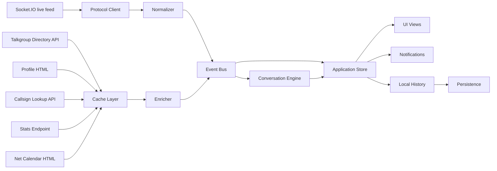
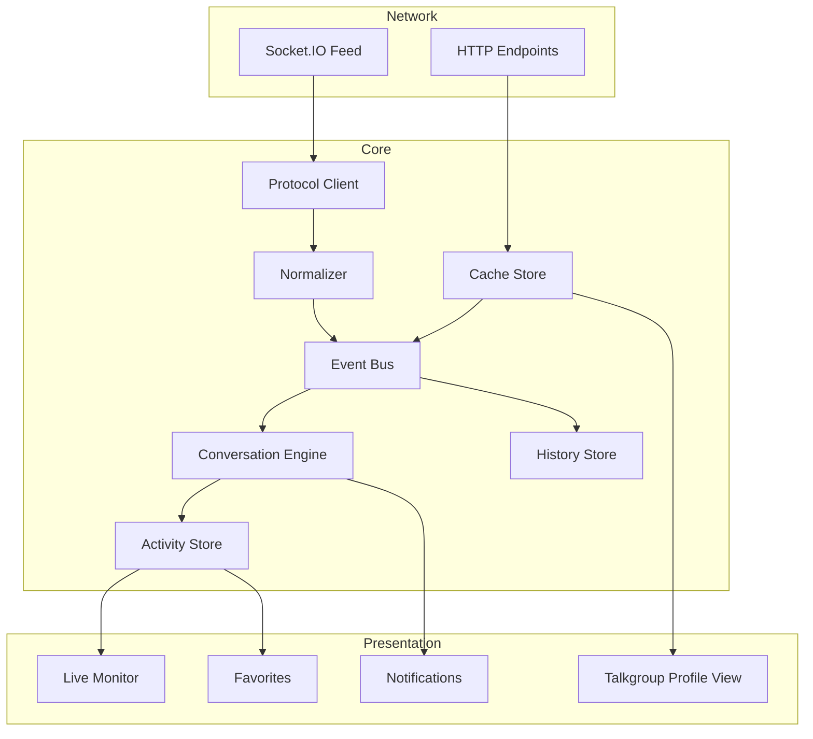

# TGIF Monitoring Client Architecture

Research pass: 2026-06-20. This document proposes a future application architecture based only on observed TGIF Network behavior. It does not define a finished UI or production implementation.

## Goals

- Monitor TGIF live activity through the public Socket.IO feed.
- Normalize raw TGIF events into stable domain events.
- Detect active talkgroups and real conversations without overfitting to one capture window.
- Enrich live activity with cached talkgroup directory, profile, callsign, statistics, and net calendar data.
- Keep traffic polite by caching slow and mostly static resources.

## Evidence

- Active page: `docs/samples/html/activetg.html`
- Last Heard page: `docs/samples/html/lastheard.html`
- Talkgroup list page: `docs/samples/html/talkgroups.html`
- Statistics page: `docs/samples/html/talkgroup_stats.html`
- Profile sample: `docs/samples/html/tgprofiles-100/`
- Socket samples: `docs/samples/websocket/websocket-samples.jsonl`
- Talkgroups Socket.IO capture: `docs/samples/websocket/talkgroups-list-capture.raw`
- Public directory: `docs/samples/json/talkgroups-api.json`

## High-Level Flow

## Layers

### Protocol Client

Responsibility: connect to `https://tgif.network/socket.io/` using Socket.IO over Engine.IO 3, handle handshake, heartbeat, reconnect, backlog requests, and raw event dispatch.

Inputs:

- Engine.IO polling or WebSocket transport.
- Socket.IO event frames such as `status`, `lastheard`, `lastheard_backlog`, and `talkgroups_list`.

Output:

- Raw protocol messages tagged with arrival time, transport, and event name.

### Normalizer

Responsibility: convert raw TGIF payloads into stable application events.

Rules:

- Treat `lastheard` payloads with `repeater_id != 0` as transmission/key-up observations.
- Treat `lastheard` payloads with `repeater_id == 0` and a known `streamid` as stop or clear observations.
- Preserve unknown fields and raw payloads for future compatibility.
- Do not trust optional profile fields to be present on every event.

### Event Bus

Responsibility: decouple live protocol handling from stores, analytics, history, and notification consumers.

Recommended event families:

- `connection.status`
- `activity.txStartOrUpdate`
- `activity.txStop`
- `activity.backlogLoaded`
- `directory.loaded`
- `profile.loaded`
- `callsign.loaded`
- `stats.loaded`
- `conversation.updated`

### Enricher

Responsibility: attach cached metadata to normalized activity.

Sources:

- Directory JSON from `https://api.tgif.network/dmr/talkgroups/json`
- Profile HTML from `https://tgif.network/tgprofile.php?id=<tgid>`
- Callsign details from `https://dmr.g7lrr.com/new/getcall.php?dmr_id=<radio_id>`
- User ID list from `https://api.tgif.network/dmr/userdb/<callsign>`

### Conversation Engine

Responsibility: derive active talkgroup state and user-interesting conversation state.

Inputs:

- Normalized activity events.
- Local monotonic arrival time.
- TGIF payload timestamps when present.

Outputs:

- Active talkgroups.
- Participant sets.
- Speaker-change counts.
- Conversation scores.
- Stale/inactive transitions.

### Store

Responsibility: own current live state and expose deterministic projections.

Suggested state ownership:

- Connection state belongs to the protocol client store.
- Raw activity log belongs to the history store.
- Active talkgroup state belongs to the activity store.
- Conversation metrics belong to the conversation store.
- Directory/profile/callsign caches belong to the cache store.

### UI

Responsibility: consume store projections only. The UI should not parse raw TGIF frames or fetch profile HTML directly.

### Notifications

Responsibility: subscribe to conversation and favorite changes. Notification rules should be data-driven and easy to disable.

### History and Persistence

Responsibility: keep a bounded local activity log and cache metadata for offline use. Persistence should store normalized records, not generated HTML.

## Recommended Runtime Topology

## Implementation Constraints

- Do not use profile HTML as the primary list of talkgroups. Use the public directory and fetch profile pages only on demand.
- Do not poll the statistics endpoint aggressively. The official page polls every 5 minutes and also caches.
- Do not issue callsign lookup requests on every live event. Use a TTL cache keyed by `radio_id`.
- Keep raw payload logging enabled during early development, but redact or bound logs before shipping.

## Open Design Decisions

- Desktop/mobile framework is not selected.
- Persistence backend is not selected.
- Whether to proxy TGIF traffic through an app backend is unknown. A direct client can work for Socket.IO, but CORS behavior must be verified for each HTTP endpoint in the target runtime.
