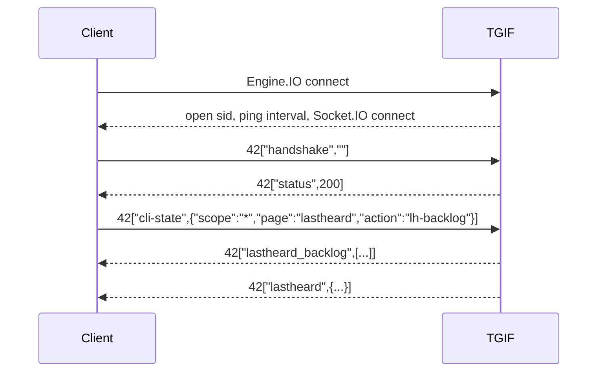

# TGIF Network Protocol Specification

Research pass: 2026-06-20. This document describes observed TGIF Network protocol behavior. Claims are tagged as Verified, Observed, Hypothesis, or Unknown.

## Transports

| Item | Value | Confidence |
| --- | --- | --- |
| Socket endpoint | `https://tgif.network/socket.io/` | Verified |
| WebSocket URL | `wss://tgif.network/socket.io/?EIO=3&transport=websocket` | Verified |
| Polling URL | `https://tgif.network/socket.io/?EIO=3&transport=polling` | Verified |
| Engine.IO protocol | EIO 3 | Verified |
| Socket.IO packet protocol | Socket.IO v2 style event frames such as `42["event", payload]` | Verified |
| Public API auth for live feed | Empty `handshake` token accepted for observed monitoring events | Verified |
| Browser origin requirement | No blocking requirement observed from command-line polling/WebSocket probes | Observed |

## Engine.IO Open Packet

Observed polling open payload:

```text
96:0{"sid":"xKkrWnA1S8HOnvU2BX0Q","upgrades":["websocket"],"pingInterval":25000,"pingTimeout":5000}2:40
```

Observed direct WebSocket open payload:

```text
0{"sid":"WKQyzokVRQP6gs23BX2z","upgrades":[],"pingInterval":25000,"pingTimeout":5000}40
```

Field meanings:

| Field | Type | Example | Meaning | Confidence |
| --- | --- | --- | --- | --- |
| `sid` | string | `xKkrWnA1S8HOnvU2BX0Q` | Engine.IO session ID | Verified |
| `upgrades` | string array | `["websocket"]` | Upgrade transports available from polling | Verified |
| `pingInterval` | number ms | `25000` | Server heartbeat interval | Verified |
| `pingTimeout` | number ms | `5000` | Client must answer ping within this timeout | Verified |

## Client Event Order

Observed official page order:



## Socket.IO Events

| Event | Direction | Payload | Meaning | Confidence |
| --- | --- | --- | --- | --- |
| `handshake` | client to server | string token, empty string in public pages | Auth or session initialization | Verified |
| `status` | server to client | number, observed `200` | Handshake result | Verified |
| `cli-state` | client to server | object | Requests a page/action state, used for lastheard backlog | Verified |
| `lastheard` | server to client | object | Live transmission or stop/update event | Verified |
| `lastheard_backlog` | server to client | array of `lastheard` objects | Backlog snapshot for initial page state | Verified |
| `talkgroups` | client to server | string, observed `list` | Requests talkgroup list over Socket.IO | Verified |
| `talkgroups_list` | server to client | array of talkgroup directory objects | Talkgroup list for `talkgroups.php` | Verified |
| `dmr` | client to server | string, observed `stats` on `index.php` | Requests DMR stats on home page | Observed |
| `server_status` | server to client | unknown | Present as commented handler on `index.php` | Hypothesis |
| `selfcare:settg` | both directions on authenticated SelfCare pages | unknown | Used by footer wrapper to detect TG change completion | Observed |
| `error` | server/client library | error | Socket error handling | Verified |
| `connect`, `disconnect`, `connect_error`, `connect_timeout`, `reconnect` | Socket.IO library events | library-defined | Connection lifecycle | Verified |

## `handshake`

Client frame:

```json
["handshake", ""]
```

Field details:

| Position | Type | Example | Meaning | Confidence |
| --- | --- | --- | --- | --- |
| 0 | string | `handshake` | Event name | Verified |
| 1 | string | `""` | API token. Public pages render `var api_token = '';` | Verified |

## `status`

Server frame:

```json
["status", 200]
```

| Field | Type | Example | Meaning | Confidence |
| --- | --- | --- | --- | --- |
| payload | number | `200` | Handshake success | Verified |

Non-200 status handling is present in official JS, but no non-200 payload was captured.

## `cli-state`

Client frame:

```json
["cli-state", {"scope":"*","page":"lastheard","action":"lh-backlog"}]
```

| Field | Type | Example | Meaning | Confidence |
| --- | --- | --- | --- | --- |
| `scope` | string | `*` | Requested scope. Only wildcard observed | Verified |
| `page` | string | `lastheard` | Page context | Verified |
| `action` | string | `lh-backlog` | Requests Last Heard backlog | Verified |

## `lastheard`

Sample:

```json
{
  "latitude": "32.75891",
  "longitude": "-97.37514",
  "timestamp": 1781957457,
  "talkgroup": 59650,
  "radio_id": 3205803,
  "repeater_id": 320580372,
  "streamid": 1065874006,
  "rssi": 0,
  "ber": 0,
  "security_level": "1",
  "admin": "no",
  "callsign": "K5AL",
  "name": "Bob ",
  "shortname": "Bob",
  "rptbaseid": 3205803,
  "rptcallsign": "K5AL",
  "talkgroup_name": "Texas-DFW Linked Systems"
}
```

Field details:

| Field | Type | Nullable/Missing | Example | Meaning | Confidence |
| --- | --- | --- | --- | --- | --- |
| `latitude` | string | can be missing | `"32.75891"` | Station or repeater latitude | Observed |
| `longitude` | string | can be missing | `"-97.37514"` | Station or repeater longitude | Observed |
| `timestamp` | number | required in observed live payloads | `1781957457` | Unix epoch seconds for the event | Verified |
| `talkgroup` | number | required in observed live payloads | `59650` | TG ID | Verified |
| `radio_id` | number | observed `0` in stop/partial event | `3205803` | DMR radio ID | Verified |
| `repeater_id` | number | observed `0` for stop/clear event | `320580372` | Repeater or session ID. `0` is used by official JS as stop/clear sentinel | Verified |
| `streamid` | number | required in observed live payloads | `1065874006` | Stream correlation ID | Verified |
| `rssi` | number | can be `0` | `47` | Signal value displayed by official Last Heard page | Observed |
| `ber` | number | can be `0` or missing | `0` | Bit error rate, used in Last Heard UI | Observed |
| `security_level` | string | can be missing | `"1"` | Official UI treats `0` as legacy styling | Observed |
| `admin` | string or object | observed string `"no"` and JS supports object | `"no"` | Admin metadata when authorized or elevated | Observed |
| `callsign` | string | missing/null in some code paths | `"K5AL"` | Operator callsign | Verified |
| `name` | string | can be missing | `"Bob "` | Display name, often includes trailing space | Verified |
| `shortname` | string | can be missing | `"Bob"` | Short display name | Verified |
| `rptbaseid` | number | optional | `3205803` | Repeater base ID used by admin tools | Observed |
| `rptcallsign` | string | optional | `"K5AL"` | Repeater callsign used by admin tools | Observed |
| `talkgroup_name` | string | optional, observed `"Unk"` | `"TGIF The Mothership"` | Display name for TG | Verified |

`repeater_id == 0` semantics:

- `activetg.php` ignores a new event with `repeater_id == 0`.
- If a matching stream/callsign exists, `activetg.php` clears button color and does not add a new active participant.
- `lastheard.php` returns early for `repeater_id == 0` unless a row exists, then clears row styling.
- Interpretation: stop/clear/update event for a stream. Confidence: Observed.

## `lastheard_backlog`

Payload: array of `lastheard` objects.

Observed active page behavior:

- Iterates each backlog item.
- Adds it as active.
- Mutates `data.repeater_id = 0`.
- Calls the same renderer again, which clears styling and starts stale removal behavior.

Meaning: current or recent activity snapshot sufficient to seed Last Heard and active TG views. Confidence: Observed.

## `talkgroups_list`

Sample item from Socket.IO capture:

```json
{
  "id": "31171",
  "name": "Illinois Link ",
  "language": "en",
  "country": "211",
  "request_timestamp": "1594716591",
  "desc": "SUxMSU5PSVMgTElOSyBNVUxUSSBNT0RF...",
  "trustee": "KB9TZQ",
  "website": "https://www.facebook.com/groups/134653443864572",
  "bridge_data": "eyIwIjogW3siYW5hZGlnaSI6MCwiYnJpZGdldHlwZSI6MCwiaWRyb29tIjoiIiwiZGVzYyI6IiJ9XX0="
}
```

Field details:

| Field | Type | Nullable/Missing | Meaning | Confidence |
| --- | --- | --- | --- | --- |
| `id` | string | no missing observed | TG ID | Verified |
| `name` | string | no missing observed | TG display name | Verified |
| `language` | string | no missing observed in capture | ISO-like language code used by TGIF JS map | Verified |
| `country` | string | no missing observed in capture | numeric country code used by TGIF JS map | Verified |
| `request_timestamp` | string unix seconds | no missing observed in capture | Date added/request timestamp | Verified |
| `desc` | base64 string | can decode to text/HTML | Talkgroup description | Verified |
| `trustee` | string | may be blank | Trustee callsign | Observed |
| `website` | string | may be blank/placeholders | Website URL or free text | Observed |
| `bridge_data` | base64 string | observed, often `e30=` for `{}` | Encoded bridge metadata | Observed |

## HTTP Directory JSON

Endpoint: `https://api.tgif.network/dmr/talkgroups/json`

Item fields:

| Field | Type | Meaning | Confidence |
| --- | --- | --- | --- |
| `id` | string | TG ID | Verified |
| `name` | string | TG name | Verified |
| `website` | string | Website, blank or placeholder common | Verified |
| `description` | string | Base64 encoded description in most entries | Verified |

The public JSON directory does not include `language`, `country`, `trustee`, `request_timestamp`, or `bridge_data`. Those were observed in the Socket.IO `talkgroups_list` payload.

## HTTP Profile HTML

Endpoint: `https://tgif.network/tgprofile.php?id=<tgid>`

Observed fields:

| Field | Source | Type | Confidence |
| --- | --- | --- | --- |
| TG ID | `h4#tgid` text | string/number | Verified |
| Name/title | page `h2` | string | Verified |
| Trustee callsign | text after `Callsign:` | string | Verified |
| Contact | text after `Contact Details:` | string | Verified |
| Country code | inline `var country = "..."` | string numeric code | Verified |
| Language code | inline `var language = "..."` | string | Verified |
| Website | `Website:` anchor | href/text | Verified |
| Image URL | `setTalkgroupImage()` assigns `avatars/talkgroups/...` | relative URL | Verified |
| Description | card after `Talkgroup Description` | HTML/text | Verified |

## Callsign Lookup

Endpoint: `https://dmr.g7lrr.com/new/getcall.php?dmr_id=<radio_id>`

Observed valid response fields:

```json
{
  "id": "219912",
  "radio_id": "3205803",
  "callsign": "K5AL",
  "name": "Bob",
  "city": "Fort Worth",
  "state": "Texas",
  "country": "United States",
  "remarks": "",
  "image": "https://cdn-xml.qrz.com/l/k5al/FB_IMG_1735064162163.jpg",
  "lat": "32.7515",
  "lon": "-97.3456",
  "license": " ",
  "license_short": " ",
  "talkgroup": "0",
  "duration": "0",
  "timestamp": "0",
  "time": "0"
}
```

For `dmr_id=0`, the captured response was empty/non-JSON. Treat invalid IDs as cacheable misses.

## Statistics JSON

Endpoint: `https://tgif.network/talkgroup_stats.php?days=<days>&topN=<topN>&search=<query>&export=json`

Observed item:

```json
{"tgid":"31665","tgname":"TGIF The Mothership","keyups":417}
```

Fields:

| Field | Type | Meaning | Confidence |
| --- | --- | --- | --- |
| `tgid` | string | TG ID | Verified |
| `tgname` | string | TG name | Verified |
| `keyups` | number | Count of key-ups in selected range | Verified |

Observed supported UI values:

- `days`: `1`, `7`, `30`
- `topN`: `10`, `20`, `30`, `50`
- `export`: `json`, `csv`
- `search`: free text

`topN=5` returned 10 rows in samples, so clients should use the documented UI values.

## Net Calendar Data

Endpoint: `https://tgif.network/nets/calendar.php`

The page embeds `const NET_DATA = [...]` directly in HTML after ensuring a `tz` query parameter.

Observed fields:

| Field | Type | Meaning | Confidence |
| --- | --- | --- | --- |
| `id` | string | Net definition hash/ID | Verified |
| `tgid` | number | Talkgroup ID | Verified |
| `net_name` | string | Net title | Verified |
| `host_callsign` | string | Host callsign(s), can be blank | Verified |
| `author_callsign` | string | Schedule author | Verified |
| `author_level` | number | Permission or trust level | Observed |
| `start_ts` | number | Base start timestamp | Verified |
| `duration` | number | Minutes | Verified |
| `recurring` | boolean | Recurrence flag | Verified |
| `recur_freq` | string | Frequency, observed `weekly` | Verified |
| `occurrence_ts` | number | Concrete occurrence timestamp | Verified |
| `instance_id` | string | `<id>:<occurrence_ts>` | Verified |

## Unknowns

- Complete server-side event list is unknown. Only events reachable from public pages and short probes are documented.
- Authenticated `selfcare:settg`, `tgcontrol.php`, and admin `admin` payload shape are not fully captured.
- Server retention window for `lastheard_backlog` is not documented.
- Whether any hidden JSON endpoint exists for `NET_DATA` is unknown.
