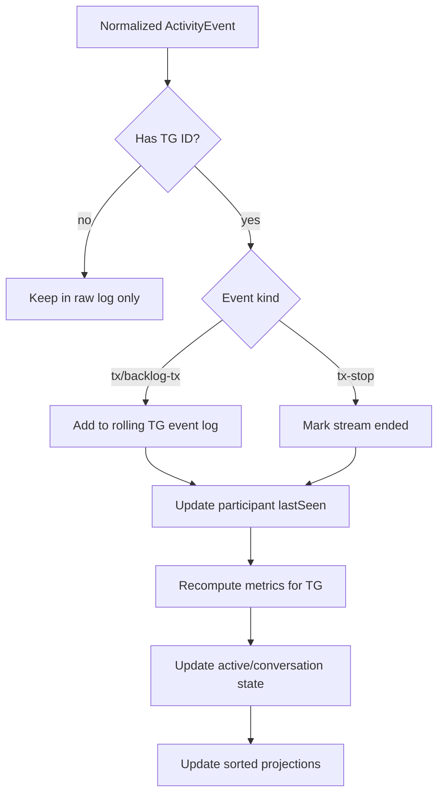

# Conversation Engine Design

The future app needs two separate concepts:

- TGIF active group: at least one callsign active or recently heard.
- User-interesting conversation: two or more unique callsigns participating inside a rolling window.

This design is based on observed Socket.IO `lastheard` data and official UI timeout behavior. It is not a server-side TGIF definition.

## Inputs

The engine consumes normalized `ActivityEvent` records:

- `kind = 'tx'` for `lastheard` where `repeater_id != 0`.
- `kind = 'tx-stop'` for `lastheard` where `repeater_id == 0`.
- `kind = 'backlog-tx'` for backlog events converted to activity records.

Required useful fields:

- `talkgroupId`
- `callsign`
- `radioId`
- `repeaterId`
- `streamId`
- `receivedAt`
- `tgifTimestamp`

## Windows

Recommended defaults:

| Window | Default | Reason |
| --- | --- | --- |
| Active participant window | 10 minutes | Official `activetg.php` removes stream entries after 600,000 ms |
| Conversation participant window | 5 minutes | More selective than active status |
| Speaker-change window | 5 minutes | Aligns with conversation window |
| Stale grace | 30 to 60 seconds | Avoid UI flicker after stop/clear |
| Local event retention | 24 hours | Enough for local history without unlimited growth |

All windows should be configurable.

## Event Processing



## Participant Counting

For each talkgroup:

1. Select events with `kind in ('tx', 'backlog-tx')`.
2. Keep only events where `receivedAt` or `tgifTimestamp` is inside the selected window.
3. Count unique participant identity.

Participant identity:

- Prefer `callsign` when non-empty.
- Else use `radioId:<radio_id>`.
- Else use `streamId:<streamid>`.

Use the same identity consistently within a session. If a later event resolves a callsign for the same radio ID, merge identities.

## Speaker Changes

Speaker-change count measures back-and-forth, not just key-ups.

Algorithm:

1. Sort recent TX events by event time.
2. Map each event to participant identity.
3. Collapse consecutive duplicate speakers.
4. `speakerChangeCount = collapsed.length - 1`.

Example:

```text
K5AL, K5AL, K4WSX, K5AL
```

Collapsed:

```text
K5AL, K4WSX, K5AL
```

Speaker changes: 2.

## Conversation Detection

A talkgroup is a conversation when all are true:

- At least 2 unique participants in the conversation window.
- At least 2 TX events in the conversation window.
- Last activity is within the stale timeout.

Optional stronger rule:

- At least 1 speaker change. This reduces false positives from two unrelated one-off key-ups.

Recommended initial setting:

```text
participantCount >= 2
transmissionCount >= 2
lastActivityAgeSeconds <= 300
```

Then expose `speakerChangeCount` and score to sort higher-quality conversations above weak matches.

## Conversation Score

Score should be explainable. Suggested formula:

```text
score =
  participantCount * 10 +
  min(transmissionCount, 10) * 2 +
  speakerChangeCount * 6 +
  recencyBonus +
  activeStreamBonus -
  stalePenalty
```

Suggested details:

- `recencyBonus`: 20 if last activity under 60 seconds, 10 if under 180 seconds, 0 otherwise.
- `activeStreamBonus`: 5 if any stream is currently active.
- `stalePenalty`: 30 if last activity exceeds conversation window.

Store score reasons:

```ts
reasons: [
  '2 participants in 5m',
  '3 speaker changes',
  'last activity 45s ago'
]
```

## Sorting Priority

Recommended active TG sort:

1. Favorites currently conversational.
2. Conversational talkgroups by score.
3. Active talkgroups by recency.
4. Scheduled live nets by start time if integrated.
5. Historical/popular TGs only when active states tie.

Never sort primarily by historical stats in the live monitor. Stats are context, not live state.

## Stop Events

Observed `repeater_id == 0` events should:

- Mark matching `streamid` as ended if known.
- Not erase the participant from rolling windows immediately.
- Not count as a new transmission.
- Update stream state for UI.

If no matching stream exists, keep in raw log and ignore for active/conversation metrics.

## Backlog Events

Backlog should seed state but avoid notification noise:

- Mark source as `backlog`.
- Add to rolling activity if timestamp/window still qualifies.
- Do not fire user notifications for backlog-only conversation transitions until at least one live event arrives.

## Edge Cases

| Edge case | Handling |
| --- | --- |
| Same callsign keys repeatedly | Active TG yes, conversation no unless another participant appears |
| Two callsigns hours apart | Active no if outside window |
| Stop event before start event | Ignore for metrics, preserve raw |
| Missing callsign with radio ID | Use radio ID identity |
| Missing callsign and radio ID | Use stream ID identity |
| `talkgroup_name == "Unk"` | Use TG ID and enrich later |
| Reconnect backlog overlap | Deduplicate by event key |
| Clock skew | Prefer server `timestamp` for ordering when plausible, use receipt time as fallback |

## False Positives

Likely causes:

- Two unrelated short calls in the same 5-minute window.
- Net check-ins with rapid one-way key-ups.
- Repeated tests by multiple stations.

Mitigations:

- Require speaker changes for "strong conversation".
- Downrank low transmission count.
- Add user favorites and mute rules.

## False Negatives

Likely causes:

- Long pauses between operators.
- Callsign missing from some events.
- One operator talks for a long time before another replies.

Mitigations:

- Show "active" separately from "conversation".
- Allow wider conversation windows.
- Merge identities by radio ID when callsign appears later.

## Future Improvements

- User-tunable scoring.
- Net-aware scoring from calendar data.
- Favorite TG priority.
- Per-TG learned baseline activity.
- Optional local ML classifier only after enough labeled local history exists.
