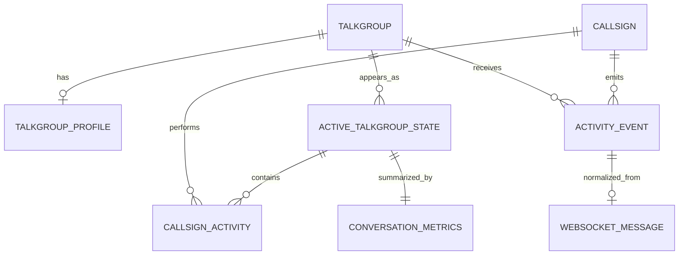

# Domain Data Model

This model is a proposal for future implementation. It is based on observed TGIF data and keeps raw protocol fields available.

Suggested file path:

```text
src/domain/tgif/types.ts
```

## Entity Relationships



## TypeScript Interfaces

```ts
export type Confidence = 'verified' | 'observed' | 'hypothesis' | 'unknown';

export type TgifConnectionState =
  | 'disconnected'
  | 'connecting'
  | 'engine-handshake'
  | 'socket-connected'
  | 'app-handshake'
  | 'authorized'
  | 'backlog-loading'
  | 'live'
  | 'failed';

export interface Talkgroup {
  id: number;
  idRaw: string;
  name: string | null;
  websiteRaw?: string | null;
  websiteUrl?: string | null;
  descriptionRaw?: string | null;
  descriptionText?: string | null;
  descriptionHtml?: string | null;
  languageCode?: string | null;
  countryCode?: string | null;
  trusteeCallsign?: string | null;
  requestTimestamp?: number | null;
  bridgeDataRaw?: string | null;
  bridgeDataJson?: unknown;
  sources: Array<'directory-json' | 'socket-talkgroups-list' | 'profile-html' | 'live-event'>;
  updatedAt: string;
}

export interface TalkgroupProfile {
  talkgroupId: number;
  title: string | null;
  trusteeCallsign: string | null;
  contact: string | null;
  countryCode: string | null;
  countryName?: string | null;
  languageCode: string | null;
  languageName?: string | null;
  websiteText: string | null;
  websiteHref: string | null;
  websiteUrl: string | null;
  imagePath: string | null;
  imageUrl: string | null;
  descriptionHtml: string | null;
  descriptionText: string | null;
  rawHtmlSamplePath?: string;
  fetchedAt: string;
  parseStatus: 'ok' | 'missing' | 'partial' | 'error';
  parseWarnings: string[];
}

export interface CallsignActivity {
  callsign: string;
  radioId: number | null;
  repeaterId: number | null;
  rptBaseId?: number | null;
  rptCallsign?: string | null;
  displayName: string | null;
  shortName: string | null;
  latitude?: number | null;
  longitude?: number | null;
  firstSeenAt: string;
  lastSeenAt: string;
  lastTxTimestamp: number | null;
  activeStreamIds: number[];
  txCount: number;
}

export interface ActiveTalkgroupState {
  talkgroupId: number;
  talkgroupName: string | null;
  isActive: boolean;
  isConversation: boolean;
  firstSeenAt: string;
  lastSeenAt: string;
  lastTxTimestamp: number | null;
  participantCount: number;
  participants: Record<string, CallsignActivity>;
  activeStreamIds: number[];
  recentEvents: ActivityEvent[];
  metrics: ConversationMetrics;
  staleAt: string | null;
}

export interface ActivityEvent {
  id: string;
  kind: 'tx' | 'tx-stop' | 'backlog-tx' | 'unknown';
  source: 'socket-lastheard' | 'socket-lastheard-backlog';
  receivedAt: string;
  tgifTimestamp: number | null;
  talkgroupId: number | null;
  talkgroupName: string | null;
  callsign: string | null;
  radioId: number | null;
  repeaterId: number | null;
  streamId: number | null;
  shortName: string | null;
  name: string | null;
  rssi: number | null;
  ber: number | null;
  securityLevel: string | null;
  latitude: number | null;
  longitude: number | null;
  raw: LastheardPayload;
}

export interface ConversationMetrics {
  talkgroupId: number;
  windowSeconds: number;
  staleTimeoutSeconds: number;
  participantCount: number;
  transmissionCount: number;
  speakerChangeCount: number;
  uniqueSpeakerOrder: string[];
  lastSpeaker: string | null;
  lastActivityAt: string | null;
  score: number;
  reasons: string[];
}

export type WebSocketMessage =
  | SocketStatusMessage
  | SocketLastheardMessage
  | SocketLastheardBacklogMessage
  | SocketTalkgroupsListMessage
  | SocketUnknownMessage;

export interface SocketStatusMessage {
  event: 'status';
  payload: number;
  receivedAt: string;
  rawFrame?: string;
}

export interface SocketLastheardMessage {
  event: 'lastheard';
  payload: LastheardPayload;
  receivedAt: string;
  rawFrame?: string;
}

export interface SocketLastheardBacklogMessage {
  event: 'lastheard_backlog';
  payload: LastheardPayload[];
  receivedAt: string;
  rawFrame?: string;
}

export interface SocketTalkgroupsListMessage {
  event: 'talkgroups_list';
  payload: SocketTalkgroupListItem[];
  receivedAt: string;
  rawFrame?: string;
}

export interface SocketUnknownMessage {
  event: string;
  payload: unknown;
  receivedAt: string;
  rawFrame?: string;
}

export interface LastheardPayload {
  latitude?: string;
  longitude?: string;
  timestamp?: number;
  talkgroup?: number;
  radio_id?: number;
  repeater_id?: number;
  streamid?: number;
  rssi?: number;
  ber?: number;
  security_level?: string;
  admin?: 'no' | string | Record<string, unknown>;
  callsign?: string | null;
  name?: string | null;
  shortname?: string | null;
  rptbaseid?: number;
  rptcallsign?: string;
  talkgroup_name?: string | null;
  [key: string]: unknown;
}

export interface SocketTalkgroupListItem {
  id: string;
  name: string;
  language?: string;
  country?: string;
  request_timestamp?: string;
  desc?: string;
  trustee?: string;
  website?: string;
  bridge_data?: string;
  [key: string]: unknown;
}
```

## State Ownership

| Entity | Primary owner | Persistence |
| --- | --- | --- |
| `Talkgroup` | Cache store | Yes |
| `TalkgroupProfile` | Cache store | Yes |
| `ActiveTalkgroupState` | Activity store | Optional snapshot only |
| `CallsignActivity` | Activity store plus callsign cache | Activity no, callsign details yes |
| `ActivityEvent` | Event/history store | Yes, bounded |
| `ConversationMetrics` | Conversation engine | Optional snapshot |
| `WebSocketMessage` | Protocol debug log | Optional bounded debug |

## Normalization Rules

- Convert numeric strings to numbers only in normalized fields.
- Preserve raw payloads.
- Do not discard unknown fields.
- Key talkgroups by numeric TG ID.
- Key callsign activity by callsign when present; fall back to `radioId:<id>` if callsign is missing.
- Key streams by `streamid`.

## Data Model Risks

- Some `lastheard` fields may be absent.
- `admin` can be a string or object.
- Public directory and Socket.IO talkgroup list have different schemas.
- Profile HTML can be empty or malformed.
