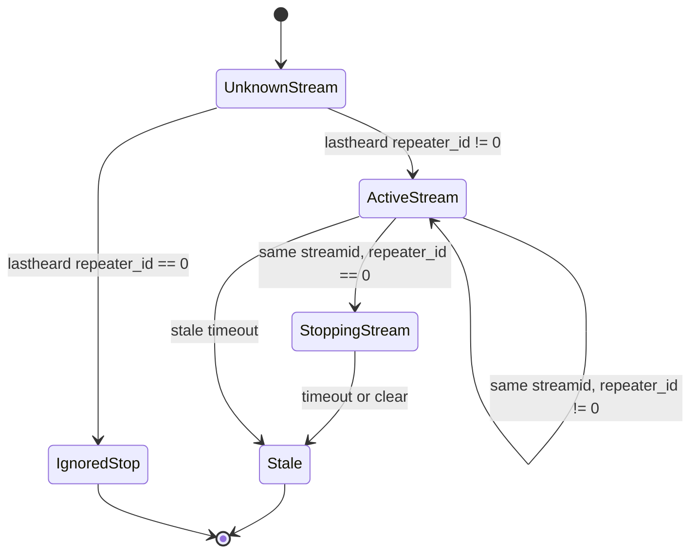

# Socket.IO Event Catalog

Research pass: 2026-06-20. This catalog covers events observed in fetched JavaScript, HTML, and short protocol captures. It is not a guarantee of every event supported by the server.

## Event Matrix

| Event | Direction | Source Evidence | Payload | Meaning | Confidence |
| --- | --- | --- | --- | --- | --- |
| `connect` | library to page | `activetg.html`, `lastheard.html`, `talkgroups.html` | none | Socket connected | Verified |
| `handshake` | client to server | `activetg.html`, `lastheard.html`, polling capture | string token | Starts server session/auth | Verified |
| `status` | server to client | `activetg.html`, `lastheard.html`, polling capture | number | Handshake result, observed `200` | Verified |
| `cli-state` | client to server | `activetg.html`, `lastheard.html`, polling capture | object | Requests page state/backlog | Verified |
| `lastheard_backlog` | server to client | `activetg.html`, `lastheard.html` | array | Initial/recent Last Heard records | Verified |
| `lastheard` | server to client | `activetg.html`, `lastheard.html`, `index.html` | object | Live activity or stop/update event | Verified |
| `talkgroups` | client to server | `talkgroups.html`, polling capture | string `list` | Requests talkgroup directory over Socket.IO | Verified |
| `talkgroups_list` | server to client | `talkgroups.html`, polling capture | array | Full talkgroup list | Verified |
| `dmr` | client to server | `index.html` | string `stats` | Requests DMR stats for home page | Observed |
| `server_status` | server to client | commented code in `index.html` | unknown | Possibly server status | Hypothesis |
| `selfcare:settg` | both directions | common footer wrapper | unknown | Authenticated SelfCare TG update acknowledgement | Observed |
| `disconnect` | library to page | `lastheard.html` | reason string | Connection lost | Verified |
| `error` | library/server to page | `activetg.html`, `lastheard.html` | error | Socket error | Verified |
| `connect_error` | library to page | `lastheard.html` | error | Initial connect failed | Verified |
| `connect_timeout` | library to page | `lastheard.html` | timeout | Initial connect timed out | Verified |
| `reconnect` | library to page | `lastheard.html` | attempt number | Reconnected | Verified |

## Required Order for Public Live Monitoring

Observed order:

1. Connect to Socket.IO.
2. Emit `handshake` with the rendered `api_token`. Public pages render it as an empty string.
3. Wait for `status`.
4. If `status == 200`, emit `cli-state` with `{"scope":"*","page":"lastheard","action":"lh-backlog"}`.
5. Process `lastheard_backlog`.
6. Process live `lastheard`.

The active page starts a 5-second timer after connect and shows `None` if `connection_state < 3`. No code in the captured active page sets `connection_state = 3`, so this appears to be stale UI logic. The live rows still update.

## `lastheard` State Transitions



## `lastheard_backlog`

Payload is an array of `lastheard`-shaped objects. Active page behavior mutates each backlog record to simulate a stop after rendering:

```js
datarecords.forEach(function (data) {
  addLastHeard(data);
  data.repeater_id = 0;
  addLastHeard(data);
});
```

Interpretation:

- The backlog seeds currently/recently active participants.
- The same stream timeout logic removes participants later.

## `talkgroups` and `talkgroups_list`

Official request:

```js
socket.emit('talkgroups', 'list');
```

Observed response is a full list, not incremental updates.

Important difference from public HTTP JSON:

- Socket.IO list includes language, country, trustee, request timestamp, base64 description, website, and base64 bridge data.
- Public HTTP JSON includes only id, name, website, description.

## `dmr`

`index.html` emits:

```js
socket.emit('dmr', 'stats');
```

The response was not captured in the current sample set. The home page also has a commented `server_status` handler. Treat both as not required for the monitoring client until observed.

## Authenticated/Admin Events

The page footer wraps `socket.emit` to watch for:

```js
socket.emit('selfcare:settg', ...)
socket.once('selfcare:settg', ...)
```

This is tied to `/profile.php?tab=SelfCare` and net calendar join flow. Public monitoring does not require it.

## Enumeration Limits

It is not possible to enumerate every server-supported event from public JavaScript alone. This document enumerates every event observed in fetched scripts and short live protocol probes.
