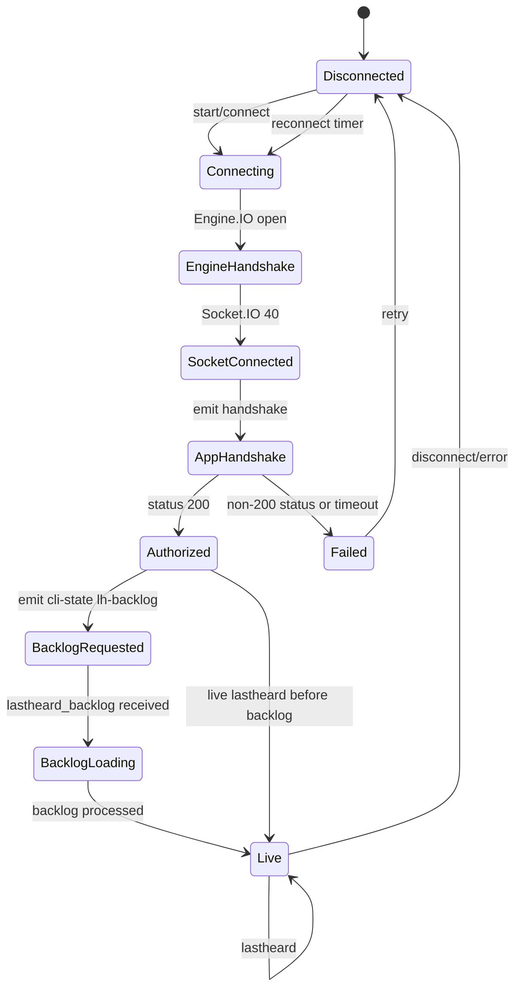
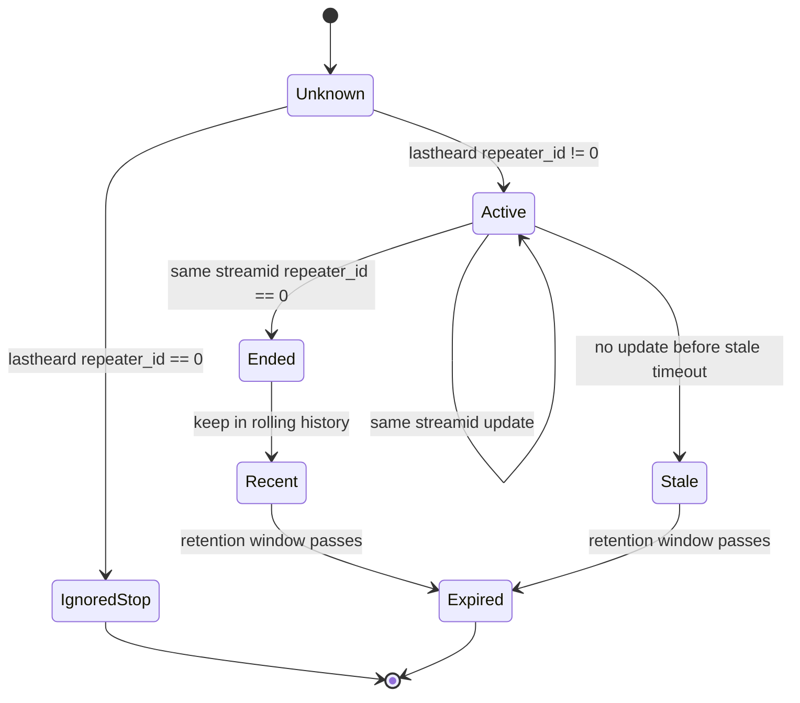
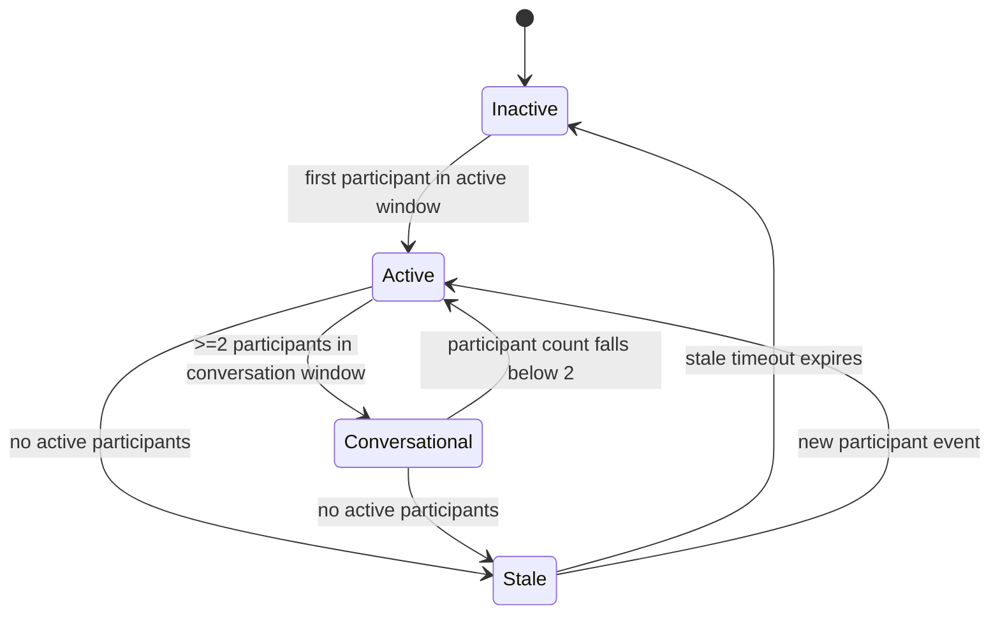
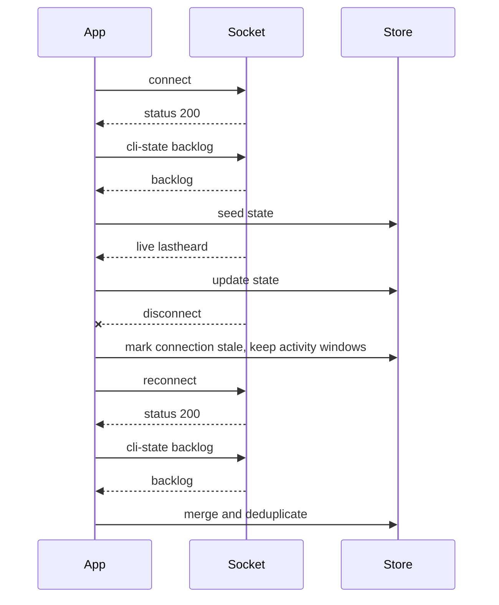

# TGIF Client State Machine

This document proposes a complete state machine for a monitoring client, based on observed TGIF Socket.IO behavior.

## Connection State



## Activity State Per Stream



## Talkgroup State



## Reconnect State



## State Ownership

| State | Owner |
| --- | --- |
| Socket connected/disconnected | Protocol client |
| Authorized/failed | Protocol client |
| Backlog loaded | Protocol client plus activity store |
| Stream active/ended/stale | Activity store |
| Talkgroup active/conversational/stale | Conversation engine |
| Cache freshness | Cache layer |

## Deduplication

On reconnect, backlog may overlap live history. Deduplicate using:

```text
eventKey = streamid + ":" + timestamp + ":" + repeater_id + ":" + callsign
```

If `callsign` is missing, use an empty string. Preserve raw duplicates in debug logs only if needed.

## Timeout Defaults

These are recommendations, not server facts:

- Active participant window: 10 minutes, matching official `activetg.php`.
- Conversation window: 5 minutes for 2+ participants.
- Stale display grace: 30 to 60 seconds.
- Raw local event retention: 24 hours by default.
